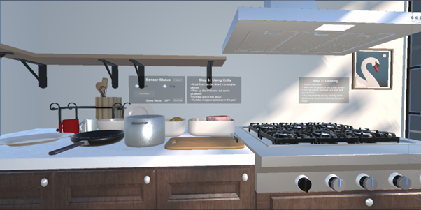
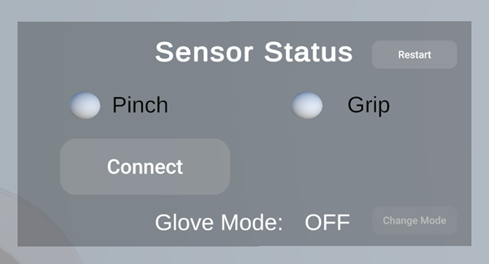
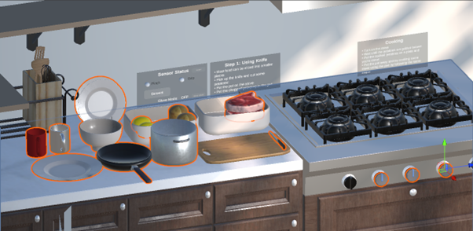
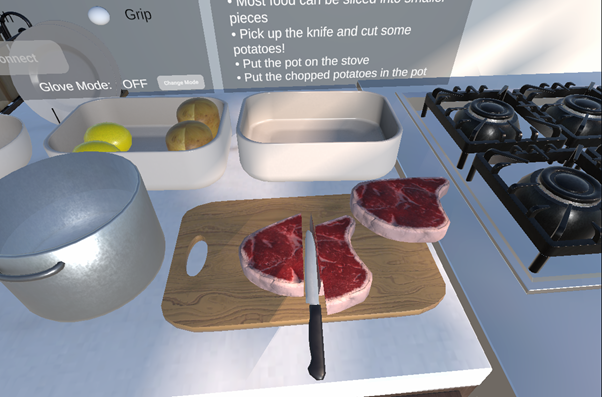

# VR Cooking Simulator Application
This application is a VR cooking game that allows players of all ages to learn fundamental skills of cooking by completing recipes using various cooking tools and ingredients. The player can play the game using two methods which are with a custom-built force-sensing glove and without the force-sensing glove. This allows the player to utilize their bare hands to interact with virtual objects which overcomes the limitation of touch controllers. It also allows for more a realistic and immersive experience for the player when interacting with the VR environment because they can feel the weight of virtual objects.

The game was developed using Unity for the Meta Quest 2.

# Features
**Game World**
 
 
  
	Upon starting the game, the player will be spawned in the kitchen. In this virtual kitchen, the player can freely interact with objects by picking them up and engaging in cooking activities such as slicing and cooking food. Specific screens and game mechanics of the game are further elaborated below.
  
  
**Sensor Status**
 

 
The player can connect a force-sensing glove to the application by selecting the “Connect” button. If the glove fails to connect. a “Failed to Connect” text will be shown. Once the glove is connected, the player can test the pinching and grabbing sensors of the glove by observing the “Pinch” and “Grip” LED lights. The lights will turn green if the sensors are working correctly. Besides that, the player can select the method of interaction that they will use in the game by selecting the “Change Mode” button. By default, the game is set to “Glove Mode: OFF”. This mode enables the player to interact with objects in the game with their bare hands without applying any force to the glove. When “Glove Mode” is set to “ON”, the player can only pick up objects by applying an appropriate amount of force while wearing the glove to simulate the feeling of weight. The objects cannot be picked up if not enough force is applied. Additionally, the player can select the “Restart” button to reset the positions of all the objects and regenerate the food objects in the game. 
 
 
**Interactable Game Objects**
 

 
Objects in the application are separated into dynamic (highlighted in orange) and static objects. Dynamic objects are objects that can moved by the player during the application’s runtime whereas static objects are any objects that cannot be picked up or moved by the player during the application’s runtime. Some of the dynamic objects include a cup, pot, plate, frying pan, bowl, knife, raw steak, potato, lemon, and kitchen stove. The player can interact with these objects using hand gestures such as pinching and grabbing. This is achieved by attaching a script called “Grabbable” to every dynamic object. This script is a part of the Oculus Interaction SDK and is used to enable objects to be grabbed by the player within a virtual environment. Additionally, this script has been modified to include the Boolean variable “includeInExperiment” to allow the object to be made grabbable with or without the force-sensing glove depending on the application’s current glove mode option. For example, if “includeInExperiment” is set to true, the current object can only be picked up after the player applies a certain amount of force using the force-sensing glove.
 
Besides that, every dynamic object requires a “Rigidbody” and “Collider” component to simulate realistic physics for the object. In other words, these components will enable objects to behave realistically in response to forces, collisions, and gravity. The “Rigidbody” component contains a variable called “mass” which will be set in accordance with the object's actual weight in the real world. 
 
Lastly, a "ForceManager" script is attached to each dynamic object and is used when the application's glove mode is set to "On”. This script has a variable called “weight” that stores the minimum force necessary to pick up the object. When the player tries to pick up an object, the script will check whether the player’s hand gesture is pinching or grabbin. If the gesture is correct, the player's applied force with the force-sensing glove is collected. If the applied force is more than or equal to the minimum force required to lift the current object, the object will be picked up by the player’s hand.
 
**Slicing**
 

 
All food objects in the application can be sliced into smaller pieces using the knife. When the knife meets the food object, the “SliceObject” script will create two new food objects from the target food object after estimating the motion of the knife using the “VelocityEstimator” script. The “VelocityEstimator” script is a script that was originally developed by the Valve Corporation that estimates the velocity of an object based on the change in its position. The newly created food objects will have all the same properties and behaviours as the original target food object. This means that they can be grabbed, sliced, and cooked. The original food object is destroyed after it has been sliced. Additionally, a slicing audio clip will be played when a food object is sliced using the “AudioSource” component that is attached to the knife object. This is to enhance the realism and user experience for the player.
 
 
**Cooking**
  

 
All food objects in the application can be cooked using the stove. After the stove is turned on, a fire will be emitted. When the food object touches the fire, the food object will begin to cook. This is achieved by attaching the “CookingController” script to each food object. This script will detect when the food object is exposed to fire and change its colour gradually from its current colour to a burnt colour using the “LerpColor()” function. When the object leaves the fire, the colour change process is stopped. Additionally, the script will play a unique cooking audio when the object is cooking. For example, a steak will make a sizzling sound when it is cooked on a frying pan whereas a potato will make a boiling sound when it is cooked in a pot of water.
 
# External Libraries
 
 
Ezy-Slice by https://github.com/DavidArayan/ezy-slice
